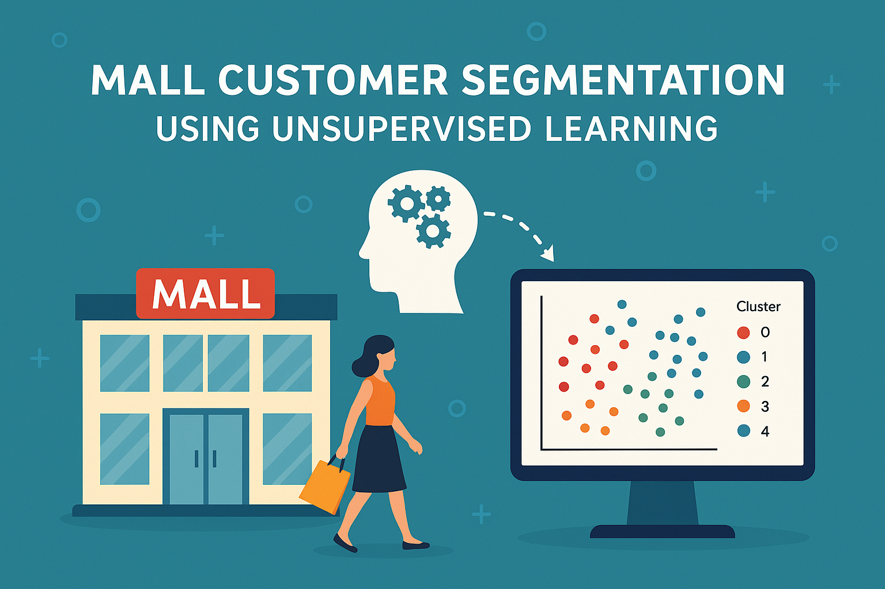

  

# 🛍️ Mall Customer Segmentation using Unsupervised Learning

This project applies **unsupervised machine learning techniques** to the [Mall Customers dataset](https://www.kaggle.com/datasets/abdallahwagih/mall-customers-segmentation) in order to segment customers based on their purchasing behavior. By using clustering and dimensionality reduction, we aim to uncover patterns in customer demographics and spending habits that can be useful for marketing and business strategy.

---

## 🎯 Objective

The main goal is to **segment customers into meaningful groups** using clustering algorithms like K-Means and Hierarchical Clustering. These insights can help businesses better understand their target audience and tailor marketing strategies accordingly.

---

## 🔍 Techniques Used

- 📊 **Data Exploration & Preprocessing**
  - Descriptive statistics
  - Outlier and missing value checks
  - Feature scaling using `StandardScaler`

- 🎯 **Clustering Algorithms**
  - K-Means Clustering with Elbow Method
  - Agglomerative (Hierarchical) Clustering using different linkage methods
  - Silhouette Score analysis for cluster quality

- 🔄 **Dimensionality Reduction**
  - PCA (Principal Component Analysis)
  - t-SNE (t-Distributed Stochastic Neighbor Embedding)

- 📈 **Data Visualization**
  - Pairplots, histograms, scatter plots
  - Dendrograms
  - PCA and t-SNE comparison plots

---

## 📌 Key Insights

- K-Means clustering revealed **5 optimal customer segments** based on age, income, and spending score.
- Hierarchical clustering produced similar groups but was slightly less efficient in separating clusters.
- **t-SNE** provided better visual separation of clusters compared to PCA.
- Segments ranged from **young high spenders** to **older low spenders**, useful for personalized marketing.

---

## 📦 Libraries Used

- `pandas`
- `numpy`
- `matplotlib`
- `seaborn`
- `scikit-learn`
- `scipy`

---

## 📊 Dataset Description

The dataset includes the following columns:

- `CustomerID`: Unique ID for each customer (dropped in modeling)
- `Genre`: Gender (used only for exploration)
- `Age`: Age of customer
- `Annual Income (k$)`: Income in thousands of dollars
- `Spending Score (1–100)`: A score assigned based on customer behavior and spending patterns

---

## 💡 Future Improvements

- Include gender as a factor in clustering
- Use advanced clustering algorithms (DBSCAN, Gaussian Mixture Models)
- Deploy an interactive dashboard to explore segments

---

## 📚 Acknowledgments

- Dataset: [Kaggle - Mall Customers](https://www.kaggle.com/datasets/abdallahwagih/mall-customers-segmentation)

---

## 🧠 Author

**Hermela Seltanu Gizaw**  
Data Science & Analytics Student | United States International University - Africa

---

Feel free to ⭐ star or fork the repo if you found it helpful!
